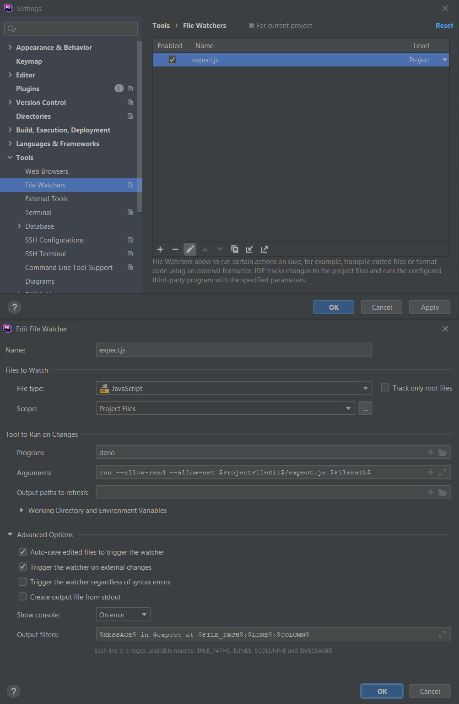
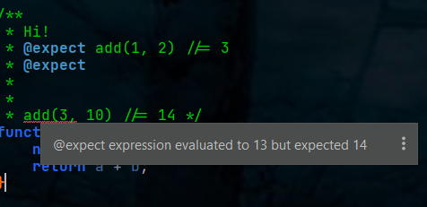

# expect.js


Execute any `@expect` tags in DocComments and report any errors.  Requires Deno to run.

```javascript
// example.js:

/**
 * This is a comment.
 * @expect add(1, 2) //= 3
 * @expect
 * add(3, 10) //= 14 
 * @return {int} */
function add(a, b) {
	return a + b;
}

```

```bash
> deno --allow-read --allow-net expect.js example.js
Got 13 but expected 14 in @expect at examples/example.js:11:1.
```


## Integration with IntelliJ IDEs.

You can make IntelliJ IDE's automatically underline any failing expects in red.

1. Install the [File Watcher](https://www.jetbrains.com/help/idea/using-file-watchers.html) plugin.
2. Setup the FileWatcher as seen in the screenshot below:
    1. Arguments: `run --allow-read --allow-net $ProjectFileDir$/build/expect.js $FilePath$`
    2. Output filters: `$MESSAGE$ in @expect at $FILE_PATH$:$LINE$:$COLUMN$`



You should then see real-time errors in IntelliJ as you type:



## Building

Run `build.bat` from within the `build` folder.  Requires Node.js to build.

